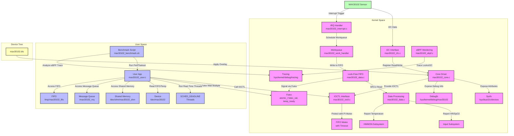

## UML Diagram
```
classDiagram
    class max30102_data {
        +struct i2c_client *client
        +rwlock_t lock
        +struct work_struct work
        +struct gpio_desc *irq_gpio
        +struct gpio_desc *reset_gpio
        +struct miscdevice miscdev
        +struct input_dev *input_dev
        +struct regulator *vcc_regulator
        +struct device *hwmon_dev
        +struct max30102_fifo fifo
        +uint32_t red_data[32]
        +uint32_t ir_data[32]
        +uint8_t data_len
        +bool fifo_full
        +wait_queue_head_t wait_data_ready
        +struct dentry *debug_dir
        +struct rt_mutex fifo_mutex
        +struct srcu_struct fifo_srcu
        +atomic_t futex_val
        +atomic_t temp_ready
        +u64 rcu_gp_seq
    }

    class max30102_fifo {
        +struct max30102_fifo_entry entries[32]
        +atomic_t head
        +atomic_t tail
    }

    class max30102_fifo_entry {
        +uint32_t red
        +uint32_t ir
        +struct rcu_head rcu
    }

    class max30102_core {
        +max30102_probe()
        +max30102_remove()
        +max30102_suspend()
        +max30102_resume()
        +temperature_show()
        +status_show()
        +led_current_show()
        +led_current_store()
    }

    class max30102_i2c {
        +max30102_write_reg()
        +max30102_read_reg()
    }

    class max30102_interrupt {
        +max30102_irq_handler()
        +max30102_work_handler()
    }

    class max30102_data_ops {
        +max30102_read_fifo()
        +max30102_read_temperature()
        +max30102_rcu_free()
    }

    class max30102_config {
        +max30102_init_sensor()
        +max30102_set_mode()
        +max30102_set_slot()
        +max30102_set_interrupt()
        +max30102_set_fifo_config()
        +max30102_set_spo2_config()
    }

    class max30102_ioctl {
        +max30102_open()
        +max30102_ioctl()
        +max30102_compat_ioctl()
    }

    class max30102_user {
        +main()
        +fifo_thread()
        +temp_thread()
        +signal_handler()
        +futex_waitv()
    }

    class max30102_ebpf {
        +bpf_probe_rt_mutex_lock()
        +bpf_retprobe_rt_mutex_lock()
        +bpf_probe_spin_lock()
        +bpf_retprobe_spin_lock()
        +bpf_probe_i2c_transfer()
        +bpf_retprobe_i2c_transfer()
    }

    max30102_data o--> max30102_fifo : contains
    max30102_fifo o--> max30102_fifo_entry : contains
    max30102_core --> max30102_data : uses
    max30102_i2c --> max30102_data : uses
    max30102_interrupt --> max30102_data : uses
    max30102_data_ops --> max30102_data : uses
    max30102_config --> max30102_data : uses
    max30102_ioctl --> max30102_data : uses
    max30102_user --> max30102_ioctl : calls
    max30102_ebpf --> max30102_data : monitors
```


## Architecture Flow
```
graph TD
    A[MAX30102 Sensor] -->|I2C Data| B[I2C Interface: max30102_i2c.c]
    A -->|Interrupt| C[IRQ Handler: max30102_interrupt.c]
    
    subgraph Kernel Space
        B -->|Read/Write Registers| D[Core Driver: max30102_core.c]
        C -->|Schedule Work| E[Workqueue: max30102_work_handler]
        E -->|FIFO Write| F[Lock-Free FIFO: max30102_data.c]
        F -->|SRCU Read| G[Data Processing: max30102_data.c]
        G -->|Heart Rate/SpO2| H[Input Subsystem]
        G -->|Temperature| I[HWMON Subsystem]
        D -->|Sysfs Attributes| J[Sysfs: /sys/bus/i2c/devices]
        D -->|Debugfs| K[Debugfs: /sys/kernel/debug/max30102]
        D -->|IOCTL Interface| L[IOCTL: max30102_ioctl.c]
        L -->|PI Mutex| M[FIFO Mutex with Timeout]
        F -->|Futex Wake| N[Futex: atomic_t futex_val, temp_ready]
        O[eBPF Monitoring: max30102_ebpf.c] -->|Trace Locks/I2C| P[/sys/kernel/debug/tracing]
    end
    
    subgraph User Space
        Q[User App: max30102_user.c] -->|IOCTL Calls| L
        Q -->|Futex Wait Multiple| N
        Q -->|SCHED_DEADLINE| R[Real-Time Threads]
        Q -->|Read FIFO/Temp| S[/dev/max30102]
        Q -->|Shared Memory| T[/dev/shm/max30102_shm]
        Q -->|Message Queue| U[/max30102_mq]
        Q -->|FIFO| V[/tmp/max30102_fifo]
        W[Benchmark Script: max30102_benchmark.sh] -->|Perf/Taskset| Q
        W -->|eBPF Trace| P
    end
    
    subgraph Device Tree
        X[max30102.dts] -->|Overlay| D
    end
```


