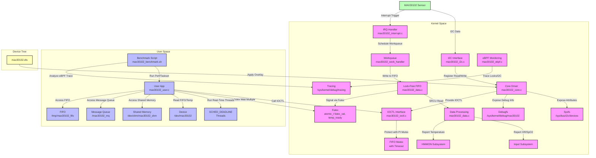

# RT-MAX30102: Real-Time HealthSync Kernel Driver

## Introduction

**RT-MAX30102** is a high-performance Linux kernel driver for the MAX30102 heart rate and SpO2 sensor, optimized for real-time, SMP/NUMA systems. It provides robust data acquisition, processing, and synchronization for health monitoring applications. The driver leverages advanced kernel features like lock-free algorithms, priority inheritance (PI) mutexes, futex synchronization, and eBPF monitoring to ensure low-latency, high-scalability, and deadlock-free operation.

This project includes a kernel module, a user-space application, a device tree overlay, an eBPF program for tracing, and a benchmark script to evaluate performance. It is designed to be upstream-ready for the Linux kernel with comprehensive documentation and testing.

## Project Structure

The project consists of 12 files, each serving a specific role in the driver or user-space ecosystem:

- **max30102_core.c**: Core driver logic, handling probe/remove, sysfs, debugfs, input, hwmon, runtime PM, and regulator/GPIO.
- **max30102.dts**: Device tree overlay for hardware configuration (I2C address, GPIOs, regulator).
- **max30102.h**: Header file defining registers, structures, and function prototypes.
- **max30102_user.c**: User-space application using SCHED_DEADLINE, futex wait multiple, and synchronization via shared memory, message queue, and FIFO.
- **Makefile**: Builds the kernel module and links object files.
- **max30102_ioctl.c**: Implements IOCTL interface with PI mutex and timeout-based lock breaking.
- **max30102_i2c.c**: Manages I2C communication with NUMA-aware memory allocation.
- **max30102_data.c**: Handles lock-free ring buffer with SRCU and RCU grace period monitoring.
- **max30102_config.c**: Configures sensor settings (mode, slot, interrupt, FIFO, SpO2).
- **max30102_interrupt.c**: Processes interrupts and workqueue with dynamic priority adjustment.
- **max30102_ebpf.c**: eBPF program for tracing rt_mutex, spinlock, and I2C contention.
- **max30102_benchmark.sh**: Benchmarks futex vs. poll latency and SMP/NUMA concurrency.

## Features

The RT-MAX30102 driver incorporates advanced features for real-time performance, scalability, and reliability:

1. **Advanced Deadlock Avoidance**:
   - **Timeout-based Lock Breaking**: Uses `rt_mutex_trylock_timeout` (1s) in `max30102_ioctl.c` to prevent deadlocks.
   - **Lock Hierarchy Enforcement**: Utilizes `lockdep_assert_held` to ensure correct lock ordering.
   - **eBPF Monitoring**: Traces rt_mutex, spinlock, and I2C contention in `max30102_ebpf.c` to detect livelock/deadlock risks.

2. **Kernel Preemption and SMP/NUMA Scalability**:
   - **CPU Affinity**: Pins IRQs to specific CPUs (`irq_set_affinity` in `max30102_core.c`) and tasks (`sched_setaffinity` in `max30102_user.c`).
   - **NUMA Optimization**: Uses `numa_mem_id()` in `max30102_i2c.c` for memory allocation on multi-node systems.
   - **Concurrency Benchmarking**: Measures cache misses and cycles using `perf` and `taskset` in `max30102_benchmark.sh`.

3. **Lock-Free Enhancements**:
   - **Lock-Free Ring Buffer**: Replaces spinlocks with `atomic_t` head/tail and `call_rcu` in `max30102_data.c`.
   - **RCU Grace Period Monitoring**: Tracks RCU grace periods via `rcu_gp_seq` in `max30102_data.c` and exposes via debugfs.

4. **Real-Time Enhancements**:
   - **SCHED_DEADLINE**: Implements real-time threads with 1ms runtime, 2ms deadline/period in `max30102_user.c`.
   - **Dynamic Priority Adjustment**: Boosts priority in `max30102_interrupt.c` when FIFO is near full (`data_len > 28`).

5. **Futex Optimization**:
   - **Futex Wait Multiple**: Synchronizes FIFO and temperature events in `max30102_user.c` using `futex_waitv`.
   - **Latency Benchmarking**: Compares futex vs. poll latency in `max30102_benchmark.sh`.

6. **Core Driver Features**:
   - **Probe/Remove**: Robust device initialization and cleanup in `max30102_core.c`.
   - **Interrupt Handling**: Efficient IRQ processing with workqueue in `max30102_interrupt.c`.
   - **FIFO and Temperature**: Accurate data acquisition and processing in `max30102_data.c`.
   - **Input/HWMON**: Reports heart rate/SpO2 via input subsystem and temperature via hwmon.
   - **Sysfs/Debugfs**: Exposes sensor status, LED current, and RCU metrics.
   - **Runtime PM**: Optimizes power usage with regulator and GPIO control.
   - **Device Tree**: Configures hardware via `max30102.dts`.


## UML Diagram
```
classDiagram
    class max30102_data {
        +struct i2c_client *client
        +rwlock_t lock
        +struct work_struct work
        +struct gpio_desc *irq_gpio
        +struct gpio_desc *reset_gpio
        +struct miscdevice miscdev
        +struct input_dev *input_dev
        +struct regulator *vcc_regulator
        +struct device *hwmon_dev
        +struct max30102_fifo fifo
        +uint32_t red_data[32]
        +uint32_t ir_data[32]
        +uint8_t data_len
        +bool fifo_full
        +wait_queue_head_t wait_data_ready
        +struct dentry *debug_dir
        +struct rt_mutex fifo_mutex
        +struct srcu_struct fifo_srcu
        +atomic_t futex_val
        +atomic_t temp_ready
        +u64 rcu_gp_seq
    }

    class max30102_fifo {
        +struct max30102_fifo_entry entries[32]
        +atomic_t head
        +atomic_t tail
    }

    class max30102_fifo_entry {
        +uint32_t red
        +uint32_t ir
        +struct rcu_head rcu
    }

    class max30102_core {
        +max30102_probe()
        +max30102_remove()
        +max30102_suspend()
        +max30102_resume()
        +temperature_show()
        +status_show()
        +led_current_show()
        +led_current_store()
    }

    class max30102_i2c {
        +max30102_write_reg()
        +max30102_read_reg()
    }

    class max30102_interrupt {
        +max30102_irq_handler()
        +max30102_work_handler()
    }

    class max30102_data_ops {
        +max30102_read_fifo()
        +max30102_read_temperature()
        +max30102_rcu_free()
    }

    class max30102_config {
        +max30102_init_sensor()
        +max30102_set_mode()
        +max30102_set_slot()
        +max30102_set_interrupt()
        +max30102_set_fifo_config()
        +max30102_set_spo2_config()
    }

    class max30102_ioctl {
        +max30102_open()
        +max30102_ioctl()
        +max30102_compat_ioctl()
    }

    class max30102_user {
        +main()
        +fifo_thread()
        +temp_thread()
        +signal_handler()
        +futex_waitv()
    }

    class max30102_ebpf {
        +bpf_probe_rt_mutex_lock()
        +bpf_retprobe_rt_mutex_lock()
        +bpf_probe_spin_lock()
        +bpf_retprobe_spin_lock()
        +bpf_probe_i2c_transfer()
        +bpf_retprobe_i2c_transfer()
    }

    max30102_data o--> max30102_fifo : contains
    max30102_fifo o--> max30102_fifo_entry : contains
    max30102_core --> max30102_data : uses
    max30102_i2c --> max30102_data : uses
    max30102_interrupt --> max30102_data : uses
    max30102_data_ops --> max30102_data : uses
    max30102_config --> max30102_data : uses
    max30102_ioctl --> max30102_data : uses
    max30102_user --> max30102_ioctl : calls
    max30102_ebpf --> max30102_data : monitors
```


## Architecture Flow
```
graph TD
    A[MAX30102 Sensor] -->|I2C Data| B[I2C Interface\nmax30102_i2c.c]
    A -->|Interrupt Trigger| C[IRQ Handler\nmax30102_interrupt.c]
    
    subgraph Kernel Space
        B -->|Register Read/Write| D[Core Driver\nmax30102_core.c]
        C -->|Schedule Workqueue| E[Workqueue\nmax30102_work_handler]
        E -->|Write to FIFO| F[Lock-Free FIFO\nmax30102_data.c]
        F -->|SRCU Read| G[Data Processing\nmax30102_data.c]
        G -->|Report HR/SpO2| H[Input Subsystem]
        G -->|Report Temperature| I[HWMON Subsystem]
        D -->|Expose Attributes| J[Sysfs\n/sys/bus/i2c/devices]
        D -->|Expose Debug Info| K[Debugfs\n/sys/kernel/debug/max30102]
        D -->|Provide IOCTL| L[IOCTL Interface\nmax30102_ioctl.c]
        L -->|Protect with PI Mutex| M[FIFO Mutex\nwith Timeout]
        F -->|Signal via Futex| N[Futex\natomic_t futex_val, temp_ready]
        O[eBPF Monitoring\nmax30102_ebpf.c] -->|Trace Locks/I2C| P[Tracing\n/sys/kernel/debug/tracing]
    end
    
    subgraph User Space
        Q[User App\nmax30102_user.c] -->|Call IOCTL| L
        Q -->|Futex Wait Multiple| N
        Q -->|Run Real-Time Threads| R[SCHED_DEADLINE\nThreads]
        Q -->|Read FIFO/Temp| S[Device\n/dev/max30102]
        Q -->|Access Shared Memory| T[Shared Memory\n/dev/shm/max30102_shm]
        Q -->|Access Message Queue| U[Message Queue\n/max30102_mq]
        Q -->|Access FIFO| V[FIFO\n/tmp/max30102_fifo]
        W[Benchmark Script\nmax30102_benchmark.sh] -->|Run Perf/Taskset| Q
        W -->|Analyze eBPF Trace| P
    end
    
    subgraph Device Tree
        X[max30102.dts] -->|Apply Overlay| D
    end

    classDef kernel fill:#f9f,stroke:#333,stroke-width:2px;
    classDef user fill:#bbf,stroke:#333,stroke-width:2px;
    classDef hardware fill:#bfb,stroke:#333,stroke-width:2px;
    classDef device_tree fill:#ffb,stroke:#333,stroke-width:2px;

    class A hardware;
    class B,C,D,E,F,G,H,I,J,K,L,M,N,O,P kernel;
    class Q,R,S,T,U,V,W user;
    class X device_tree;
```



## Getting Started
1. **Prerequisites**: Linux kernel 5.16+ with PREEMPT_RT, MAX30102 sensor connected via I2C (address 0x57).
2. **Build**: Run `make` to build the kernel module and `gcc -o max30102_user max30102_user.c -pthread -lrt` for the user app.
3. **Install Device Tree**: Compile and apply `max30102.dts` using `dtc` and configfs.
4. **Run**: Execute `sudo insmod max30102_driver.ko` and `sudo ./max30102_user`.
5. **Benchmark**: Run `sudo ./max30102_benchmark.sh` to measure performance.

For detailed build and test instructions, refer to the project documentation or previous responses.

## License
This project is licensed under the GPL-2.0 License. See the `MODULE_LICENSE("GPL")` in `max30102_core.c`.
